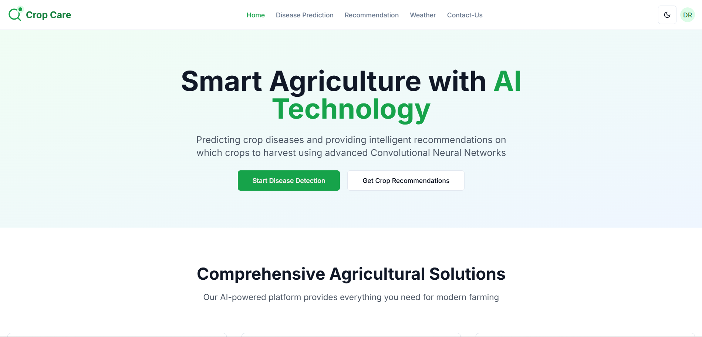
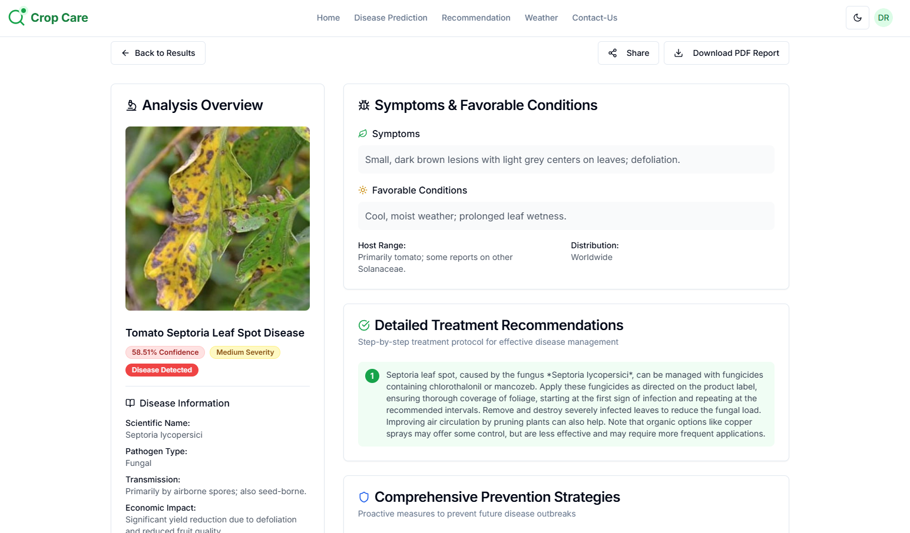
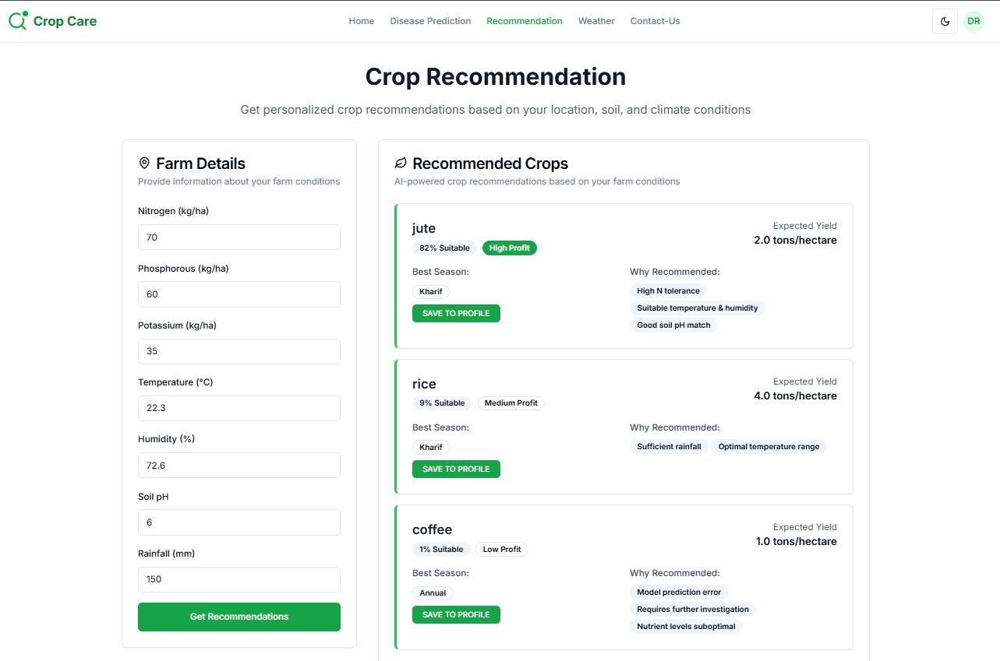
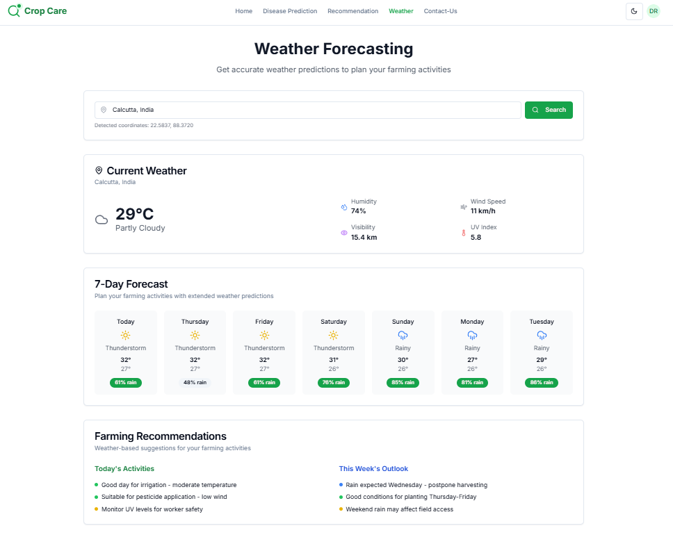
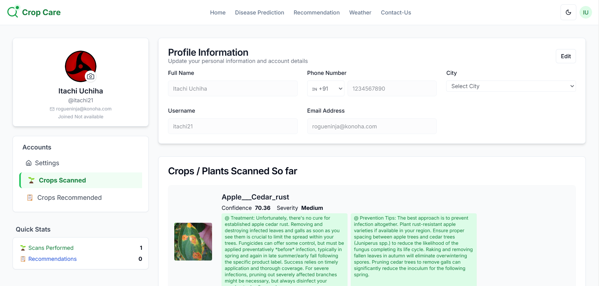

# 🌾 Crop Care - AI-Powered Agricultural Platform

Crop Care is a next-generation web platform designed to empower farmers, agronomists, and agricultural professionals with actionable AI insights. Our mission is to make advanced crop management accessible, data-driven, and easy for everyone—no technical expertise required.

With Crop Care, you can:

- **Diagnose crop diseases instantly** by uploading a photo of your crop leaf. Get not just a prediction, but also detailed, step-by-step treatment and prevention strategies tailored to your crop.
- **Receive personalized crop recommendations** based on your local conditions, helping you maximize yield and sustainability.
- **Access real-time weather forecasts** to plan your farming activities and reduce risk.
- **Manage your farming profile and history** with a secure, user-friendly dashboard. Save, revisit, and share your reports anytime.
- **Share professional, AI-generated reports** with agronomists, experts, or your farming community for collaboration and advice.

### What Makes Crop Care Unique?

- **AI-Powered, End-to-End:** All predictions and recommendations are powered by robust machine learning models (deployed on Hugging Face), ensuring accuracy and reliability.
- **User-Centric Design:** Clean, intuitive interface that works seamlessly on any device—mobile, tablet, or desktop.
- **Actionable Insights:** Not just predictions, but clear, practical steps for treatment, prevention, and crop planning.
- **Instant Sharing:** Generate and share secure, professional reports with a single click.
- **No Technical Barriers:** Designed for real-world farmers and professionals—just upload, click, and get results.

---



---

## ✨ Feature Snapshots

<table>
  <tr>
    <td align="center"><br/><b>Disease Prediction</b></td>
    <td align="center"><br/><b>Crop Recommendation</b></td>
  </tr>
  <tr>
    <td align="center"><br/><b>Weather Forecast</b></td>
    <td align="center"><br/><b>Profile Dashboard</b></td>
  </tr>
</table>

---

## 🛠️ Getting Started

### Prerequisites

- Node.js 18+
- MongoDB Atlas account

### 1. Clone the Repository

```bash
git clone https://github.com/D-roy-2003/CropCare.git
cd CropCare
```

### 2. Install Dependencies

```bash
npm install
```

### 3. Environment Configuration

Create a `.env.local` file in the root directory:

```env
# MongoDB Configuration
MONGODB_URI=your_mongodb_connection_string

# JWT Configuration
JWT_SECRET=your_jwt_secret
JWT_EXPIRES_IN=7d

# Application URL
NEXTAUTH_URL=your_deployed_vercel_link

# Security
BCRYPT_ROUNDS=12

GEMINI_API_KEY=your_gemini_api_key

# Backend API
BACKEND_URL=your_backend_api_url

NEXT_PUBLIC_SUPABASE_URL=your_supabase_url
NEXT_PUBLIC_FORMSPREE_ENDPOINT=your_formspree_endpoint
NEXT_PUBLIC_SITE_URL=your_deployed_vercel_link
```

### 4. Run the Development Server

```bash
npm run dev
```

Open [http://localhost:3000](http://localhost:3000) to view the application.

---

## 📁 Project Structure

```plaintext
CropCare/
├── app/                    # Next.js App Router (API routes, pages, layouts, etc.)
│   ├── api/                # API endpoints (disease prediction, recommendation, etc.)
│   ├── disease-details/    # Disease details client and page
│   ├── disease-prediction/ # Disease prediction UI
│   ├── profile/            # User profile page
│   ├── recommendation/     # Crop recommendation UI
│   ├── shared/             # Shared report pages
│   ├── weather/            # Weather forecast UI
│   ├── ...                 # Other feature folders (login, signup, contact, etc.)
│   └── globals.css         # Global styles
├── backend-api/            # Backend API (ML model serving, Docker, etc.)
├── components/             # Reusable UI components (navbar, footer, shadcn/ui, etc.)
├── hooks/                  # Custom React hooks
├── lib/                    # Utility libraries (auth, db, PDF, validation, etc.)
├── mlmodel_training/       # Jupyter notebooks and scripts for ML model training
├── models/                 # MongoDB models (User, DiseasePrediction, etc.)
├── public/                 # Static assets (images, icons, etc.)
├── styles/                 # Additional CSS files
├── CropCare-mirror/        # Git mirror/backup (if used)
├── middleware.ts           # Next.js middleware
├── package.json            # Project dependencies and scripts
├── README.md               # Project documentation
└── ...                     # Config files, scripts, etc.
```

---

## 🤝 Contributing

1. Fork the repository
2. Create a feature branch (`git checkout -b feature/amazing-feature`)
3. Commit your changes (`git commit -m 'Add amazing feature'`)
4. Push to the branch (`git push origin feature/amazing-feature`)
5. Open a Pull Request

---

## 👤 Developer

- [Prasenjit Datta](https://github.com/pra-sen-jit)

---

## 📞 Support

For support, email pr.datta.2021@gmail.com or create an issue in this repository.

---

**Made with ❤️ for farmers worldwide** 🌾
